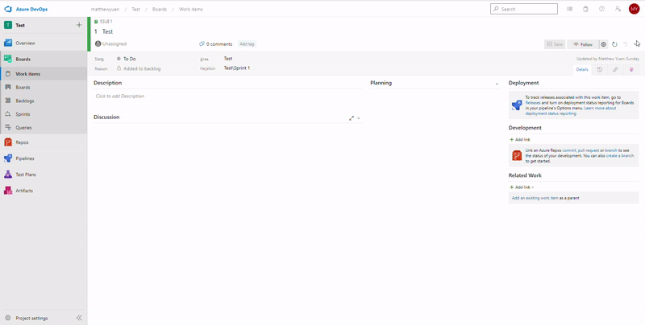
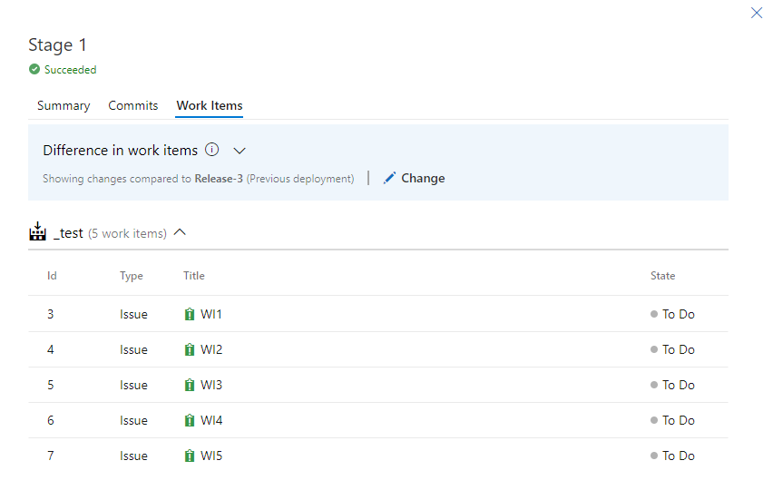

# Link Work Items from Release 

## Features

This extension adds an action to the work item context menu which links all new work items from a selected release's deployment to the current work item.  The new work items are determined by taking the difference between the selected release deployment's work items and the previous deployment's work item.

The queries to fetch this data are almost identical to those which are used to display the "Difference in work items" on the release pipeline page.

## References

* https://github.com/microsoft/azure-devops-extension-sample
* https://developer.microsoft.com/en-us/azure-devops/develop/extensions
* https://docs.microsoft.com/en-us/azure/devops/extend/overview